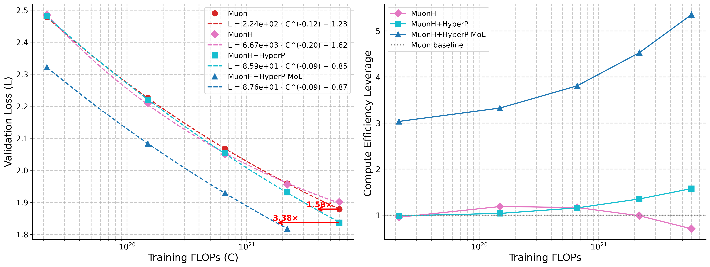

<h1 align="left" style="display: flex; align-items: center;">
  ArchScale
  
</h1>


**Simple & Scalable Pretraining for Neural Architecture Research**

ArchScale is a comprehensive toolkit for training and evaluating neural language models with a focus on architecture and scaling laws. It provides implementations of various state-of-the-art architectures, scaling techniques, training optimizations and evaluation tools in a unified codebase.


## Updates
- [Mar. 30] Released the code for MoE training with [HyperP](assets/Rethinking_Language_Model_Scaling_under_Transferable_Hypersphere_Optimization_final.pdf) (Hypersphere Parameterization) scaling, [SqrtGate](assets/Rethinking_Language_Model_Scaling_under_Transferable_Hypersphere_Optimization_final.pdf), and [MuonH](https://whenwen.github.io/wd_blog/public/hyperball-part-1.html) optimizer!
<p align="center">
  
</p>

- [Sept. 25] Phi-4-mini-flash has been accepted by NeurIPS 2025!
- [July 25] Released the code for large-scale pre-training of Phi-4-mini-flash!
- [July 25] Released the code for training [Decoder-Hybrid-Decoder Architectures](https://aka.ms/flashreasoning-paper) ([poster](assets/sambay_poster.pdf)) with μP++, and the model checkpoint for [Phi-4-mini-flash-reasoning](https://huggingface.co/microsoft/Phi-4-mini-flash-reasoning)
<p align="center">
  
  
</p>

## Features

- **Architectures**: Transformers (MHA/GQA), various SSM/attention modules, [Gated Memory Unit](https://aka.ms/flashreasoning-paper), [YOCO](https://arxiv.org/abs/2405.05254), [Differential Attention](https://arxiv.org/pdf/2410.05258) and flexible hybrid stacks (SambaY, Phi-4-mini-Flash, etc.).
- **Mixture-of-Experts**: Fine-grained token-choice routing with [SonicMoE](https://github.com/Dao-AILab/sonic-moe) acceleration, shared experts, [SqrtGate](assets/Rethinking_Language_Model_Scaling_under_Transferable_Hypersphere_Optimization_final.pdf) and global auxiliary load-balancing loss.
- **Scaling Laws**: [HyperP](assets/Rethinking_Language_Model_Scaling_under_Transferable_Hypersphere_Optimization_final.pdf), [μP++](https://aka.ms/flashreasoning-paper), μP, Chinchilla FLOPs scaling, data scaling, and scaling laws for batch size, weight decay, and MoE granularity.
- **Optimizers**: [MuonH](https://whenwen.github.io/wd_blog/public/hyperball-part-1.html), [Muon](lit_gpt/optim/muon.py), AdamW, and hybrid optimizer support.
- **Research-Friendly**: Easy adding/modifying architectures/scaling-laws/optimizers/scheduling/initialization, [WYSIWYG](https://en.wikipedia.org/wiki/WYSIWYG) philosophy for experiments logging.
- **Performance**: 🚀 Flash-Attention 4 + SonicMoE + FSDP2 distributed training, mixed precision, FP8/MXFP8 via [TransformerEngine](https://github.com/NVIDIA/TransformerEngine), activation checkpointing, and CPU offloading.
- **Training**: Data mixture support (JSON config), packed dataset with pre-tokenization, variable-length training for long-context, fused cross-entropy for large vocabulary stability, batch size ramp-up scheduling, and orthogonal/diagonal weight initialization.
- **Evaluation**: [lm-eval](https://github.com/EleutherAI/lm-evaluation-harness) integration for standard NLP benchmarks, long-context evaluation on RULER and Phonebook, [Proof-Pile](eval_proofpile.py) perplexity evaluation, [LightEval](eval_reason/)-based reasoning evaluation (AIME, MATH-500, GPQA), and scaling curve fitting via [plotting scripts](plots/).

## Installation

We provide [`install.sh`](install.sh) for bootstrapping the training environment. The script auto-detects GPU type (GB200/B100 vs H100/H200) and installs the appropriate PyTorch wheel along with all dependencies:

```bash
bash install.sh
source .venv/bin/activate
```

This installs PyTorch, Lightning, Flash Attention (v2/v3/v4), TransformerEngine, Mamba, causal-conv1d, flash-linear-attention, SonicMoE, and other required packages.

## Pretraining

One can refer to the [Samba](https://github.com/microsoft/Samba/?tab=readme-ov-file#data-preparation) codebase for SlimPajama data tokenization. We also provide the pre-tokenized SlimPajama data [here](https://huggingface.co/datasets/jsun/slimpajama_Llama2_Tokenizer).


### MoE Training

Train Mixture-of-Experts models with SonicMoE acceleration:

```bash
torchrun --nnodes=1 --nproc_per_node=8 --rdzv_backend=c10d  --rdzv_endpoint=${MASTER_ADDR}:${MASTER_PORT} pretrain.py \
    --train_data_dir path/to/slim_pajama/data  --val_data_dir path/to/slim_pajama/data \
    --train_model transformer_gqa4_h2_moe --depth 8 \
    --sparsity 8 --top_k 4 --share_expert true --global_aux true --sqrt_gate true \
    --train_name v2scale_mup_muonh_ga_qknorm_sgate_shexp --fsdp2 true
```

Key MoE options include `--sparsity` (number of experts = sparsity * top_k), `--top_k` (experts per token), `--share_expert` (one shared dense expert), `--global_aux` (global load-balancing loss), and `--sqrt_gate` (SqrtGate for stable MoE granularity scaling under hypersphere optimization). MoE FLOPs scaling is supported with the same μP++ and hyperP transfer:

```bash
for depth in 8 12 16 20 24; do
    torchrun --nnodes=1 --nproc_per_node=8 --rdzv_backend=c10d  --rdzv_endpoint=${MASTER_ADDR}:${MASTER_PORT} pretrain.py \
        --train_data_dir path/to/slim_pajama/data  --val_data_dir path/to/slim_pajama/data \
        --train_model transformer_gqa4 --depth ${depth} \
        --sparsity 8 --top_k 4 --share_expert true --global_aux true --sqrt_gate true \
        --train_name v2scale_mup_muonh_ga_qknorm_sgate_shexp  --fsdp2 true
done
```

This trains the MoE model up-to 22.9B total parameters.

See [launch_scripts/](launch_scripts/) for more templates on MoE/dense model training and hyperparameter tuning with various scaling and ablation configurations explored in the [paper](assets/Rethinking_Language_Model_Scaling_under_Transferable_Hypersphere_Optimization_final.pdf).


### Scaling FLOPs

Training across a scale from 110M to 3.3B-parameter SambaY model with μP++ and Chinchilla token scaling on 8 GPUs is as simple as:

```bash
for depth in 8 12 16 20 24; do
    torchrun --nnodes=1 --nproc_per_node=8 --rdzv_backend=c10d  --rdzv_endpoint=${MASTER_ADDR}:${MASTER_PORT} pretrain.py \
        --train_data_dir path/to/slim_pajama/data  --val_data_dir path/to/slim_pajama/data \
        --train_model sambay --depth ${depth} \
        --train_name scaling_mup
done
```
In the backend, a dataclass [`BaseHyperparameters`](pretrain.py#L83) defines the optimization related HyperParameters (HPs) for a d8 (depth=8) model, and the scaling laws defined in [`setup`](pretrain.py#L172) function will transfer these HPs to the actual HPs used at the target depth such as d12, d16 or d24. After the training finished, we can use the [plotting scripts](plots/) to fit the scaling curves and compare the fitted scaling parameters between different architectures.

### Scaling Data

To study the data scaling law, we can scale from 100B to 600B tokens for a 1B-parameter Transformer++ model with μP++ and tied embeddings on 64 GPUs using the following script:

```bash
for tok in 1e11 2e11 3e11 4e11 5e11 6e11; do
    torchrun --nnodes=8 --nproc_per_node=8 --rdzv_backend=c10d  --rdzv_endpoint=${MASTER_ADDR}:${MASTER_PORT} pretrain.py \
        --train_data_dir path/to/slim_pajama/data  --val_data_dir path/to/slim_pajama/data \
        --train_model transformer --depth 16 --max_tokens ${tok} \
        --train_name scaling_mup_tie
done
```


## Long-Context Training

After shuffling and pre-tokenizing the [ProLong-64K](https://huggingface.co/datasets/princeton-nlp/prolong-data-64K) data (Pre-tokenized data is [here](https://huggingface.co/datasets/jsun/Prolong_64K_v2_Llama2_Tokenizer)!), we can train a d16 model with 32K sequence length and 40B tokens on 8 GPUs using the following script:  
```bash
torchrun --nnodes=1 --nproc_per_node=8 --rdzv_backend=c10d  --rdzv_endpoint=${MASTER_ADDR}:${MASTER_PORT} pretrain.py \
    --train_data_dir path/to/prolong/data  --val_data_dir path/to/prolong/data \
    --train_model transformer --depth 16 --ctx_len 32768 --max_tokens 4e10 \
    --train_name scaling_mup_rbase_varlen
```
where the symbol in the train_name, `rbase`, will trigger the model use a larger RoPE base for long-context training and `varlen` will applies variable length training that seperates documents based on the EOS tokens. Our codebase currently supports training with a maximum of 128K sequence length for a d20 model with `--fsdp_save_mem=true`.

For variable length training on Mamba-1 based models, extra dependencies need to be installed:

```bash
git clone https://github.com/zigzagcai/varlen_mamba.git --branch feat/add-cu_seqlens
cd varlen_mamba
pip install --no-build-isolation -e .
```

## Evaluation

ArchScale provides comprehensive evaluation support for trained models across multiple domains:

### Standard NLP Benchmarks

Evaluate trained models on common language understanding tasks for SambaY architecture with multiple GPUs:

```bash
accelerate launch eval.py --model ArchScale \
    --model_args pretrained=path/to/checkpoint.pth,config="sambay_d16" \
    --tasks wikitext,lambada_openai,arc_easy,arc_challenge,winogrande,hellaswag,piqa,social_iqa \
    --device cuda --batch_size 16 --trust_remote_code
```
The script will infer the μP++ and architecture modification based on name of ckpt path.

### Proof-Pile Evaluation

Evaluate long-context perplexity using the [Proof-Pile](https://huggingface.co/datasets/hoskinson-center/proof-pile) dataset with sliding window inference (following LongLoRA):

```bash
python eval_proofpile.py \
    --checkpoint_path path/to/checkpoint.pth \
    --config "sambay_d16" \
    --seq_length 32768 \
    --sliding_window 256 \
    --batch_size 1
```

### Long-Context Evaluation

#### RULER Benchmark
Evaluate long-context capabilities using the [RULER](https://arxiv.org/abs/2404.06654) benchmark with multiple GPUs:

```bash
accelerate launch eval.py --model ArchScale \
    --model_args pretrained=path/to/checkpoint.pth,config="sambay_d16",max_length=32768,tokenizer=Orkhan/llama-2-7b-absa \
    --metadata='{"max_seq_lengths":[32768]}' \
    --tasks niah_single_1 --device cuda --batch_size 8 --trust_remote_code
```

This runs a simple needle-in-a-haystack task at 32K context length.

#### Phonebook Evaluation
Test long-context retrieval using the [Phonebook](https://arxiv.org/abs/2402.01032) benchmark with 32K context length:

```bash
python eval_phonebook.py \
    --checkpoint_path path/to/checkpoint.pth \
    --config "model_config" \
    --min_eval_len 1850 \
    --max_eval_len 1850 \
    --output_dir results_dir \
    --eval_batch_size 4
```

### Reasoning Evaluation

Evaluate reasoning capabilities on mathematical and scientific tasks (AIME, MATH-500, GPQA) using [LightEval](https://github.com/huggingface/lighteval) with vLLM backend:

```bash
./eval_reason/eval_reason.sh 42 microsoft/Phi-4-mini-flash-reasoning aime24 output_dir
```

The reasoning evaluation supports multi-GPU evaluation with configurable generation parameters (temperature, top-p, max tokens). The script requires `lighteval` and `math-verify` dependencies. We currently provide the vLLM inference support in this [PR](https://github.com/vllm-project/vllm/pull/20702).

### Scaling Analysis

The [plots/](plots/) directory provides scripts for fitting and visualizing scaling curves:

```bash
python plots/plot_moe_scaling_comparison.py   # MoE FLOPs scaling curves
python plots/plot_scaling_comparison.py        # Dense model scaling comparison
python plots/plot_muonh_comparison.py          # MuonH vs baseline comparison
python plots/plot_bsz_scaling.py               # Batch size scaling analysis
python plots/plot_stability.py                 # Training stability analysis
```

## Citation

If you find our work useful, please consider citing:

```bibtex
@article{ren2026rethinking,
  title={Rethinking Language Model Scaling under Transferable Hypersphere Optimization},
  author={Liliang Ren and Yang Liu and Yelong Shen and Weizhu Chen},
  year={2026},
  url={https://github.com/microsoft/ArchScale}
}


@software{archscale2025,
  title={ArchScale: Simple and Scalable Pretraining for Neural Architecture Research},
  author={Liliang Ren and Zichong Li and Yelong Shen},
  year={2025},
  url={https://github.com/microsoft/ArchScale}
}


@article{ren2025decoder,
  title={Decoder-Hybrid-Decoder Architecture for Efficient Reasoning with Long Generation},
  author={Liliang Ren and Congcong Chen and Haoran Xu and Young Jin Kim and Adam Atkinson and Zheng Zhan and Jiankai Sun and Baolin Peng and Liyuan Liu and Shuohang Wang and Hao Cheng and Jianfeng Gao and Weizhu Chen and Yelong Shen},
  journal={arXiv preprint arXiv:2507.06607},
  year={2025}
}
```

## License

This project is licensed under the MIT License - see the [LICENSE](LICENSE) file for details.

## Acknowledgments
- [SonicMoE](https://github.com/Dao-AILab/sonic-moe)
- [Samba](https://github.com/microsoft/Samba/)
- [LitGPT](https://github.com/Lightning-AI/litgpt)
- [TinyLlama](https://github.com/jzhang38/TinyLlama)
- [Flash Linear Attention](https://github.com/fla-org/flash-linear-attention)
- [TransformerEngine](https://github.com/NVIDIA/TransformerEngine)

---

**Happy scaling! 🚀**
